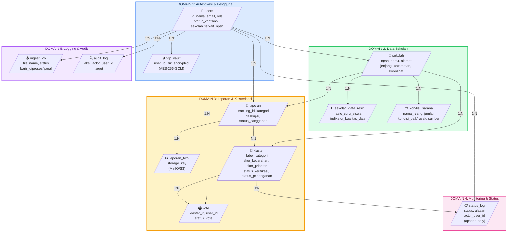

# Entity Relationship Diagram (ERD) — Database SIMAKIS

---

## 1. Peta Domain Database (untuk PPT)



---

## 2. Detailed ERD (Relasi Kolom Lengkap)

```mermaid
erDiagram

    users ||--o{ pdp_vault : has
    users ||--o{ sekolah : "terkait (sekolah_terkait_npsn)"
    users ||--o{ laporan : "dikirim"
    users ||--o{ vote : "dibuat"
    users ||--o{ status_log : "actor"
    users ||--o{ ingest_job : "uploaded_by"
    users ||--o{ audit_log : "actor"

    sekolah ||--o{ sekolah_data_resmi : "memiliki"
    sekolah ||--o{ kondisi_sarana : "memiliki"
    sekolah ||--o{ laporan : "terkait"
    sekolah ||--o{ klaster : "memiliki"

    laporan ||--o{ laporan_foto : "memiliki"
    laporan ||--o{ klaster : "terkait"

    klaster ||--o{ vote : "memiliki"
    klaster ||--o{ status_log : "memiliki"

    %% ========== DOMAIN 1: Autentikasi & Pengguna ==========
    users {
        string id PK "UUID"
        string nama
        string email "UNIQUE"
        string password_hash
        string role "ENUM"
        string status_verifikasi "ENUM"
        string sekolah_terkait_npsn FK "nullable"
        datetime created_at
    }

    pdp_vault {
        string user_id PK FK "to users.id"
        blob nik_encrypted
        datetime created_at
    }

    %% ========== DOMAIN 2: Data Sekolah ==========
    sekolah {
        string npsn PK "VARCHAR(20)"
        string sekolah_id "UUID, nullable"
        string nama
        string alamat "nullable"
        string jenjang "ENUM(SD,SMP,SMA,SMK)"
        string status_sekolah "ENUM(Negeri,Swasta), nullable"
        string kecamatan "nullable"
        string desa_kelurahan "nullable"
        decimal lintang "nullable"
        decimal bujur "nullable"
        string akreditasi "nullable"
        string nama_kepsek "nullable"
        string sumber_data "default: Dapodik"
        date tanggal_pembaruan_data "nullable"
        date tanggal_verifikasi_baseline "nullable"
        datetime created_at
    }

    sekolah_data_resmi {
        string id PK "UUID"
        string sekolah_npsn FK "to sekolah.npsn"
        string rasio_guru_siswa "nullable"
        string indikator_kualitas_data "nullable"
        datetime created_at
    }

    kondisi_sarana {
        string id PK "UUID"
        string sekolah_npsn FK "to sekolah.npsn"
        string nama_ruang
        int jumlah "default: 0"
        int kondisi_baik "default: 0"
        int kondisi_rusak_ringan "default: 0"
        int kondisi_rusak_sedang "default: 0"
        int kondisi_rusak_berat "default: 0"
        string sumber "ENUM(dapodik,laporan_warga)"
        datetime created_at
        UNIQUE(sekolah_npsn, nama_ruang, sumber)
    }

    %% ========== DOMAIN 3: Laporan & Klasterisasi ==========
    laporan {
        string id PK "UUID"
        string tracking_id "UNIQUE, indexed"
        string user_id FK "to users.id"
        string sekolah_npsn FK "to sekolah.npsn"
        string kategori "ENUM"
        string fasilitas_terkait "nullable"
        string kondisi_dilaporkan "ENUM, nullable"
        text deskripsi
        string klaster_id FK "to klaster.id, nullable"
        string status_sanggahan "ENUM"
        datetime created_at
    }

    laporan_foto {
        string id PK "UUID"
        string laporan_id FK "to laporan.id"
        string storage_key "path di MinIO/S3"
        datetime created_at
    }

    klaster {
        string id PK "UUID"
        string label "nullable"
        string kategori "ENUM"
        string sekolah_npsn FK "to sekolah.npsn"
        decimal skor_keparahan "nullable"
        int jumlah_vote_terhitung "default: 0"
        decimal skor_prioritas "nullable"
        int urutan_prioritas_override "nullable"
        text alasan_override "nullable"
        string status_verifikasi "ENUM"
        string status_penanganan "ENUM, nullable"
        datetime updated_at
        datetime created_at
    }

    vote {
        string id PK "UUID"
        string klaster_id FK "to klaster.id"
        string user_id FK "to users.id"
        string status_vote "ENUM(pending,terhitung)"
        datetime created_at
        UNIQUE(klaster_id, user_id)
    }

    %% ========== DOMAIN 4: Monitoring & Status ==========
    status_log {
        string id PK "UUID"
        string klaster_id FK "to klaster.id"
        string status "ENUM"
        text alasan "nullable"
        string actor_user_id FK "to users.id"
        datetime created_at
    }

    %% ========== DOMAIN 5: Logging & Audit ==========
    ingest_job {
        string id PK "UUID"
        string file_name
        string status "ENUM(diproses,selesai,gagal)"
        string uploaded_by FK "to users.id"
        int baris_diproses "nullable"
        int baris_gagal "nullable"
        datetime completed_at "nullable"
        datetime created_at
    }

    audit_log {
        string id PK "UUID"
        string aksi
        string actor_user_id FK "to users.id"
        string target "nullable"
        datetime created_at
    }
```

---

## 3. Legenda Warna Domain

| Domain | Warna | Tabel | Keterangan |
|--------|-------|-------|------------|
| **D1 — Autentikasi & Pengguna** | 🔵 Biru | `users`, `pdp_vault` | Akun, role RBAC, NIK terenkripsi |
| **D2 — Data Sekolah** | 🟢 Hijau | `sekolah`, `sekolah_data_resmi`, `kondisi_sarana` | Master data + kondisi infrastruktur |
| **D3 — Laporan & Klasterisasi** | 🟠 Kuning | `laporan`, `laporan_foto`, `klaster`, `vote` | Laporan warga + pengelompokan isu |
| **D4 — Monitoring & Status** | 🟣 Pink | `status_log` | Riwayat perubahan status (append-only) |
| **D5 — Logging & Audit** | 🟣 Ungu | `ingest_job`, `audit_log` | Jejak import data & audit sistem |

---

## 4. Ringkasan Jumlah Tabel

| Domain | Jumlah Tabel | PK Type |
|--------|-------------|---------|
| D1 — Autentikasi & Pengguna | 2 | UUID |
| D2 — Data Sekolah | 3 | UUID + VARCHAR(20) |
| D3 — Laporan & Klasterisasi | 4 | UUID |
| D4 — Monitoring & Status | 1 | UUID |
| D5 — Logging & Audit | 2 | UUID |
| **Total** | **12** | — |

---

**Catatan:**
- Semua tabel menggunakan `uuid` (String(36)) sebagai PK (kecuali `sekolah` pakai `npsn` VARCHAR(20))
- Semua tabel punya `created_at` timestamp (via `TimestampMixin`)
- Relasi one-to-many (1:N) ditunjukkan dengan `||--o{`
- Tabel `status_log` bersifat **append-only** (tidak ada UPDATE/DELETE dari aplikasi)
- `pdp_vault` hanya diakses via `app/core/pdp.py` (bukan via router langsung)
