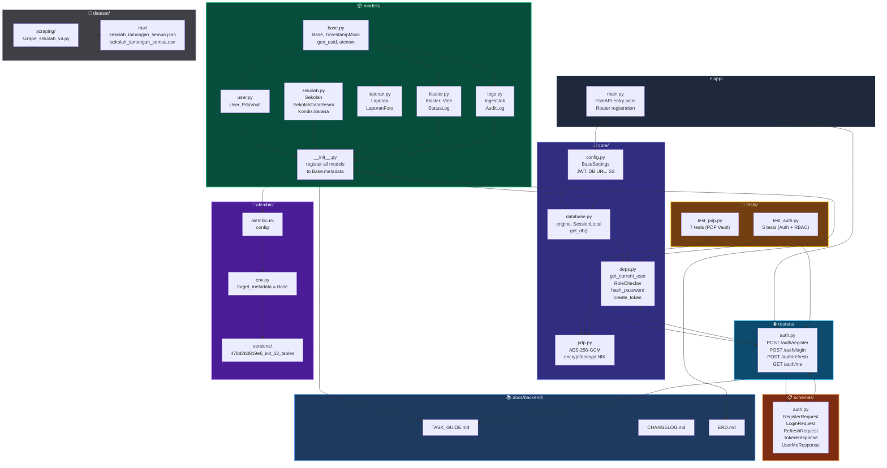

# Struktur Modular Backend — SIMAKIS



---

## Legenda Warna

| Warna | Layer | Keterangan |
|-------|-------|------------|
| ⚫ Abu Gelap | `app/` | Entry point, titik awal |
| 🟣 Ungu Tua | `core/` | Config, DB, Auth deps, PDP Vault |
| 🟢 Hijau Tua | `models/` | 12 SQLAlchemy models + base |
| 🟠 Oranye Tua | `schemas/` | Pydantic validation |
| 🔵 Biru Tua | `routers/` | FastAPI endpoints |
| 🟡 Kuning Tua | `tests/` | Unit tests |
| ⚪ Abu | `dataset/` | Scraping + raw data |
| 🟣 Ungu | `alembic/` | Migration |
| 🔵 Biru Muda | `docs/backend/` | Dokumentasi |

---

## Alur Dependensi Utama

```
main.py
  ├── config.py ──→ database.py ──→ models/__init__.py
  │                  deps.py ──→ pdp.py
  │                  ↓
  ├── routers/auth.py ──→ schemas/auth.py
  │                  ↓
  │             deps.py ──→ get_current_user (JWT)
  │                        ──→ RoleChecker (RBAC)
  │                        ──→ hash_password (pwdlib)
  │                        ──→ create_token (PyJWT)
  │
  └── test_auth.py ──→ routers/auth.py + deps.py
      test_pdp.py ──→ pdp.py
```
