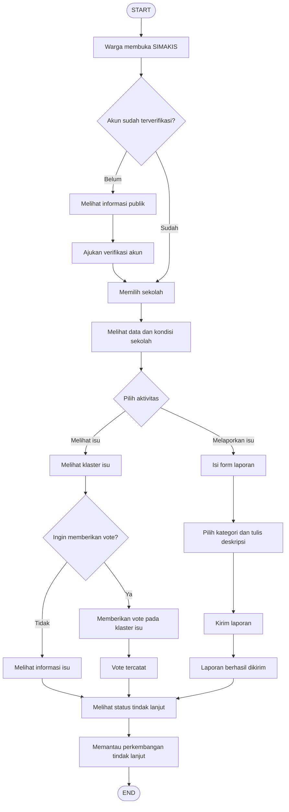
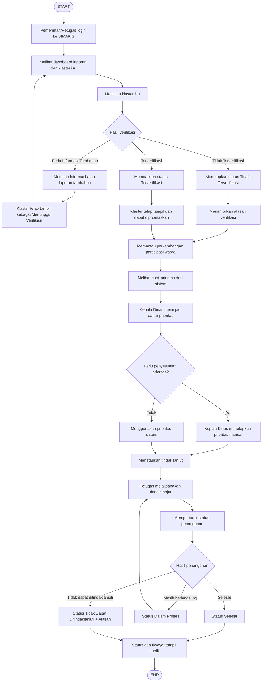

# FLOWS.md — SIMAKIS Frontend

Dokumen ini memformalkan dua alur utama sistem ke dalam Mermaid, sebagai
rujukan tunggal bagi frontend saat membangun routing, state, dan kondisi
tampilan. Diturunkan langsung dari flowchart yang disusun tim (drawio).

---

## 1. Alur Warga

---

## 2. Alur Pemerintah / Petugas

---

## Catatan penting untuk frontend

- **Loop "Masih berlangsung"** (Alur Pemerintah, node T→V→R) berarti UI status
  harus mendukung update berulang tanpa reload halaman penuh — gunakan
  polling/refetch pada komponen status, bukan hard navigation.
- **Loop "Perlu Informasi Tambahan"** (node D→E→F→B) mengembalikan klaster
  ke daftar dashboard dengan status "Menunggu Verifikasi" — pastikan badge
  ini konsisten dengan status yang sama di sisi warga.
- **Titik percabangan (decision node)** di kedua alur adalah sumber utama
  untuk PAGE_STATES.md — setiap decision node berarti minimal 2 varian
  tampilan/komponen kondisional yang harus disediakan.
