# Struktur Modular Frontend — SIMAKIS

> Stack: **Vite + React 18 + TypeScript + Tailwind CSS + shadcn/ui**
> Routing: **React Router** | HTTP: **Axios** | State: **React Query**

```mermaid
flowchart TB
    subgraph ROOT["⚡ src/"]
        style ROOT fill:#1e293b,stroke:#f8fafc,stroke-width:3px,color:#f8fafc
        main["main.tsx<br/>React entry point"]
        app["App.tsx<br/>Router provider<br/>QueryClient provider"]
    end

    subgraph ROUTES["📂 routes/"]
        style ROUTES fill:#0c4a6e,stroke:#38bdf8,stroke-width:2px,color:#e0f2fe
        index_r["index.tsx<br/>Root route"]
        warga_r["warga.tsx<br/>Layout warga"]
        pemerintah_r["pemerintah.tsx<br/>Layout pemerintah"]
    end

    subgraph PAGES_W["📄 pages/warga/"]
        style PAGES_W fill:#064e3b,stroke:#34d399,stroke-width:2px,color:#d1fae5
        dashboard_w["DashboardWarga.tsx<br/>Beranda + ringkasan isu"]
        direktori["DirektoriSekolah.tsx<br/>Daftar sekolah + pencarian"]
        detail_sek["DetailSekolah.tsx<br/>Info sekolah + kondisi sarana"]
        form_laporan["FormLaporan.tsx<br/>Buat laporan baru"]
        riwayat["RiwayatLaporan.tsx<br/>Status laporan user"]
        klaster_w["KlasterIsu.tsx<br/>Daftar klaster + voting"]
    end

    subgraph PAGES_G["📄 pages/pemerintah/"]
        style PAGES_G fill:#7c2d12,stroke:#fb923c,stroke-width:2px,color:#ffedd5
        dashboard_g["DashboardDinas.tsx<br/>Overview + prioritas"]
        verifikasi["VerifikasiLaporan.tsx<br/>Review laporan masuk"]
        klaster_g["ManajemenKlaster.tsx<br/>Kelola klaster + override"]
        ingest["IngestData.tsx<br/>Upload CSV Dapodik"]
        riwayat_g["RiwayatIngest.tsx<br/>Status job ingest"]
        pengguna["KelolaPengguna.tsx<br/>Manajemen user + role"]
    end

    subgraph LAYOUTS["📐 layouts/"]
        style LAYOUTS fill:#312e81,stroke:#818cf8,stroke-width:2px,color:#e0e7ff
        main_layout["MainLayout.tsx<br/>Navbar + Sidebar + Footer"]
        auth_layout["AuthLayout.tsx<br/>Login/Register centered"]
    end

    subgraph COMPONENTS_UI["🧩 components/ui/"]
        style COMPONENTS_UI fill:#4a1d96,stroke:#c084fc,stroke-width:2px,color:#ede9fe
        button_ui["Button.tsx<br/>(shadcn)"]
        card_ui["Card.tsx<br/>(shadcn)"]
        input_ui["Input.tsx<br/>(shadcn)"]
        badge_ui["Badge.tsx<br/>(shadcn)"]
        dialog_ui["Dialog.tsx<br/>(shadcn)"]
        table_ui["Table.tsx<br/>(shadcn)"]
        select_ui["Select.tsx<br/>(shadcn)"]
        tabs_ui["Tabs.tsx<br/>(shadcn)"]
    end

    subgraph COMPONENTS_I["🏛️ components/institutional/"]
        style COMPONENTS_I fill:#065f46,stroke:#10b981,stroke-width:2px,color:#d1fae5
        logo["Logo.tsx<br/>Logo SIMAKIS + nama"]
        navbar["Navbar.tsx<br/>Header + navigasi"]
        sidebar["Sidebar.tsx<br/>Menu warga/dinas"]
        footer["Footer.tsx<br/>Kontak + copyright"]
        role_badge["RoleBadge.tsx<br/>Badge role user"]
    end

    subgraph COMPONENTS_C["🔗 components/composite/"]
        style COMPONENTS_C fill:#78350f,stroke:#f59e0b,stroke-width:2px,color:#fef3c7
        sekolah_card["SekolahCard.tsx<br/>Card sekolah + jenjang"]
        laporan_card["LaporanCard.tsx<br/>Status laporan + tracking"]
        klaster_card["KlasterCard.tsx<br/>Isu + skor prioritas"]
        stat_card["StatCard.tsx<br/>Angka ringkasan"]
        filter_bar["FilterBar.tsx<br/>Filter jenjang + status"]
        pagination["Pagination.tsx<br/>Navigasi halaman"]
    end

    subgraph COMPONENTS_CH["📊 components/charts/"]
        style COMPONENTS_CH fill:#831843,stroke:#ec4899,stroke-width:2px,color:#fce7f3
        bar_chart["BarChart.tsx<br/>Distribusi jenjang"]
        pie_chart["PieChart.tsx<br/>Status laporan"]
        line_chart["LineChart.tsx<br/>Tren laporan/bulan"]
    end

    subgraph COMPONENTS_M["🗺️ components/map/"]
        style COMPONENTS_M fill:#1e3a5f,stroke:#60a5fa,stroke-width:2px,color:#dbeafe
        school_map["SchoolMap.tsx<br/>Peta lokasi sekolah<br/>(Leaflet + OpenStreetMap)"]
        marker_popup["MarkerPopup.tsx<br/>Popup info sekolah"]
    end

    subgraph LIB["⚙️ lib/"]
        style LIB fill:#1e293b,stroke:#94a3b8,stroke-width:2px,color:#e2e8f0
        utils["utils.ts<br/>cn() helper<br/>(clsx + tailwind-merge)"]
    end

    subgraph API["🔌 lib/api/"]
        style API fill:#7f1d1d,stroke:#f87171,stroke-width:2px,color:#fee2e2
        client["client.ts<br/>Axios instance<br/>Base URL, interceptors<br/>Auth header (Bearer)"]
        types["types.ts<br/>ApiResponse<T><br/>PaginationMeta<br/>ApiErrorBody"]
        auth_api["auth.ts<br/>/auth/register<br/>/auth/login<br/>/auth/refresh<br/>/auth/me"]
        sekolah_api["sekolah.ts<br/>/sekolah<br/>/sekolah/:npsn<br/>/sekolah?search="]
        laporan_api["laporan.ts<br/>/laporan<br/>/laporan/riwayat<br/>/laporan/:id"]
        klaster_api["klaster.ts<br/>/klaster<br/>/klaster/:id<br/>/klaster/:id/vote"]
        errors["errors.ts<br/>Mapping error code<br/>→ pesan UI"]
    end

    subgraph HOOKS["🪝 hooks/"]
        style HOOKS fill:#134e4a,stroke:#2dd4bf,stroke-width:2px,color:#ccfbf1
        use_auth["useAuth.ts<br/>Login/logout<br/>Current user"]
        use_sekolah["useSekolah.ts<br/>Query sekolah<br/>+ search"]
        use_laporan["useLaporan.ts<br/>CRUD laporan<br/>+ riwayat"]
        use_klaster["useKlaster.ts<br/>Query klaster<br/>+ voting"]
    end

    subgraph CONTEXT["🌐 contexts/"]
        style CONTEXT fill:#3b0764,stroke:#d946ef,stroke-width:2px,color:#fae8ff
        auth_ctx["AuthContext.tsx<br/>User state<br/>Token management"]
    end

    subgraph MOCKS["🎭 mocks/"]
        style MOCKS fill:#3f3f46,stroke:#a1a1aa,stroke-width:2px,color:#f4f4f5
        mock_sekolah["sekolah.ts<br/>62 sekolah mock"]
        mock_laporan["laporan.ts<br/>Laporan mock"]
        mock_klaster["klaster.ts<br/>Klaster + vote mock"]
    end

    subgraph STYLES["🎨 styles/"]
        style STYLES fill:#422006,stroke:#a16207,stroke-width:2px,color:#fef3c7
        globals["globals.css<br/>Tailwind base<br/>Token desain"]
        tailwind["tailwind.config.js<br/>Warna, font<br/>Spacing custom"]
    end

    %% ===== Relasi Antar Layer =====

    main --> app
    app --> index_r

    index_r --> warga_r
    index_r --> pemerintah_r
    index_r --> auth_layout

    warga_r --> main_layout
    pemerintah_r --> main_layout

    main_layout --> navbar
    main_layout --> sidebar
    main_layout --> footer

    warga_r --> dashboard_w
    warga_r --> direktori
    warga_r --> detail_sek
    warga_r --> form_laporan
    warga_r --> riwayat
    warga_r --> klaster_w

    pemerintah_r --> dashboard_g
    pemerintah_r --> verifikasi
    pemerintah_r --> klaster_g
    pemerintah_r --> ingest
    pemerintah_r --> riwayat_g
    pemerintah_r --> pengguna

    dashboard_w --> stat_card
    dashboard_w --> bar_chart
    dashboard_w --> school_map

    direktori --> sekolah_card
    direktori --> filter_bar
    direktori --> pagination

    detail_sek --> school_map

    form_laporan --> input_ui
    form_laporan --> select_ui
    form_laporan --> button_ui

    riwayat --> laporan_card

    klaster_w --> klaster_card
    klaster_w --> button_ui

    dashboard_g --> stat_card
    dashboard_g --> line_chart

    verifikasi --> laporan_card
    verifikasi --> dialog_ui

    klaster_g --> klaster_card

    ingest --> table_ui
    ingest --> button_ui

    riwayat_g --> table_ui

    pengguna --> table_ui
    pengguna --> dialog_ui

    %% API Layer
    client --> types
    client --> errors
    auth_api --> client
    sekolah_api --> client
    laporan_api --> client
    klaster_api --> client

    %% Hooks → API
    use_auth --> auth_api
    use_sekolah --> sekolah_api
    use_laporan --> laporan_api
    use_klaster --> klaster_api

    %% Context → Hooks
    auth_ctx --> use_auth

    %% Pages → Hooks
    dashboard_w --> use_sekolah
    dashboard_w --> use_laporan
    direktori --> use_sekolah
    detail_sek --> use_sekolah
    form_laporan --> use_laporan
    riwayat --> use_laporan
    klaster_w --> use_klaster
    dashboard_g --> use_laporan
    dashboard_g --> use_klaster
    verifikasi --> use_laporan
    klaster_g --> use_klaster
    ingest --> use_sekolah
    pengguna --> use_auth

    %% Lib
    utils --> button_ui
    utils --> card_ui
```



---

## Legenda Warna

| Warna | Layer | Keterangan |
|-------|-------|------------|
| ⚫ Abu Gelap | `src/` | Entry point (main.tsx, App.tsx) |
| 🔵 Biru Tua | `routes/` | React Router configuration |
| 🟢 Hijau | `pages/warga/` | Halaman untuk warga (6 halaman) |
| 🟠 Oranye | `pages/pemerintah/` | Halaman untuk dinas (6 halaman) |
| 🟣 Ungu | `layouts/` | Layout template (MainLayout, AuthLayout) |
| 🟣 Ungu Gelap | `components/ui/` | shadcn/ui components (8 komponen) |
| 🟢 Hijau Tua | `components/institutional/` | Branding (Logo, Navbar, Sidebar, Footer) |
| 🟡 Kuning | `components/composite/` | Business components (6 komponen) |
| 🩷 Pink | `components/charts/` | Chart components (3 komponen) |
| 🔵 Biru Muda | `components/map/` | Map components (Leaflet) |
| ⚪ Abu | `lib/` | Utility functions |
| 🔴 Merah | `lib/api/` | API client (Axios + types + endpoints) |
| 🩵 Cyan | `hooks/` | Custom React hooks (4 hooks) |
| 🟣 Magenta | `contexts/` | React Context (auth state) |
| ⚫ Abu Tua | `mocks/` | Mock data untuk development |
| 🟤 Coklat | `styles/` | Tailwind config + global CSS |

---

## Jumlah Komponen

| Layer | Jumlah | Keterangan |
|-------|--------|------------|
| Routes | 3 | Root, Warga, Pemerintah |
| Pages (Warga) | 6 | Dashboard, Direktori, Detail, Form, Riwayat, Klaster |
| Pages (Pemerintah) | 6 | Dashboard, Verifikasi, Klaster, Ingest, Riwayat, Pengguna |
| Layouts | 2 | MainLayout, AuthLayout |
| UI (shadcn) | 8 | Button, Card, Input, Badge, Dialog, Table, Select, Tabs |
| Institutional | 5 | Logo, Navbar, Sidebar, Footer, RoleBadge |
| Composite | 6 | SekolahCard, LaporanCard, KlasterCard, StatCard, FilterBar, Pagination |
| Charts | 3 | BarChart, PieChart, LineChart |
| Map | 2 | SchoolMap, MarkerPopup |
| API | 6 | Client, Types, Auth, Sekolah, Laporan, Klaster, Errors |
| Hooks | 4 | useAuth, useSekolah, useLaporan, useKlaster |
| Contexts | 1 | AuthContext |
| **Total** | **52** | — |

---

## Alur Data

```
User Action
    ↓
Page Component
    ↓
Custom Hook (useSekolah, useLaporan, etc.)
    ↓
API Module (lib/api/sekolah.ts, etc.)
    ↓
Axios Client (lib/api/client.ts)
    ↓
Backend API (FastAPI)
    ↓
Response → Hook → Page → UI Render
```
